# SLSA-provenance-lab

Signing an image with Cosign tells you it wasn't modified after signing. It
doesn't tell you what built it, from what source, or on what CI. This repo is a
small, working setup that generates real SLSA Build Level 3 provenance
(`slsa-github-generator`), verifies it (`slsa-verifier`), and tries to break it.

TL;DR: the break attempt didn't work the way I expected, and the actual reason is
more useful than the result I was originally going for. Details below.

## Stack

- basic FastAPI app
- GitHub Actions: build → push to GHCR → generate provenance
- [`slsa-github-generator`](https://github.com/slsa-framework/slsa-github-generator) `generator_container_slsa3.yml@v2.0.0`
- [`slsa-verifier`](https://github.com/slsa-framework/slsa-verifier) for verification
- Cosign, for comparison

## Pipeline

```yaml
jobs:
  build:
    runs-on: ubuntu-latest
    permissions:
      contents: read
      packages: write
    outputs:
      digest: ${{ steps.build.outputs.digest }}
      image: ${{ steps.image.outputs.image }}
    steps:
      - uses: actions/checkout@v4
      - uses: docker/login-action@v3
        with:
          registry: ghcr.io
          username: ${{ github.actor }}
          password: ${{ secrets.GITHUB_TOKEN }}
      - id: image
        run: echo "image=ghcr.io/${{ github.repository_owner }}/slsa-lab-app" >> "$GITHUB_OUTPUT"
      - id: build
        uses: docker/build-push-action@v6
        with:
          context: ./app
          push: true
          tags: ${{ steps.image.outputs.image }}:${{ github.sha }}

  provenance:
    needs: [build]
    permissions:
      actions: read
      id-token: write
      packages: write
    uses: slsa-framework/slsa-github-generator/.github/workflows/generator_container_slsa3.yml@v2.0.0
    with:
      image: ${{ needs.build.outputs.image }}
      digest: ${{ needs.build.outputs.digest }}
      registry-username: ${{ github.actor }}
    secrets:
      registry-password: ${{ secrets.GITHUB_TOKEN }}
```

Both jobs live in one file, connected via `needs:`. That's fine — `provenance`
isn't code I wrote, it's a call to a pinned, third-party reusable workflow. GitHub
runs it on its own runner, under its own OIDC identity (the token's
`job_workflow_ref` points at `generator_container_slsa3.yml`, not at my workflow).
A compromised `build` job can't reach into that job's process or forge its
identity, regardless of which file the YAML lives in.

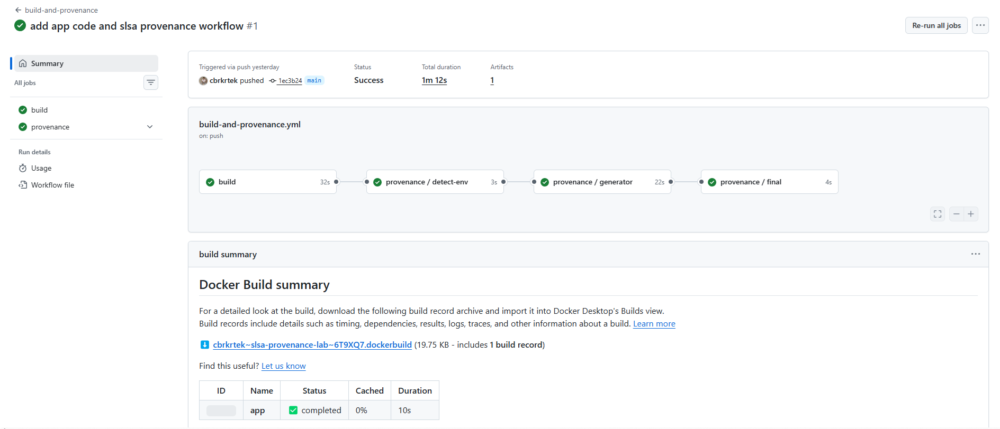

## Verifying the real image

```bash
IMAGE="ghcr.io/cbrkrtek/slsa-lab-app"
DIGEST="sha256:1c70c20db0f36b09dd0954a096050631fe3c41fa3f33e27443b4469a75a478da"

slsa-verifier verify-image "${IMAGE}@${DIGEST}" \
  --source-uri github.com/cbrkrtek/slsa-provenance-lab \
  --source-branch main
```

```
Verified build using builder "https://github.com/slsa-framework/slsa-github-generator/.github/workflows/generator_container_slsa3.yml@refs/tags/v2.0.0" at commit c92ce306870dde70e216a961c38c4112a2bfc23e
PASSED: Verified SLSA provenance
```

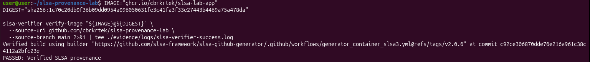

For comparison, Cosign on the same image:

```bash
cosign verify-attestation \
  --type slsaprovenance \
  --certificate-identity-regexp ".*" \
  --certificate-oidc-issuer https://token.actions.githubusercontent.com \
  "${IMAGE}@${DIGEST}"
```

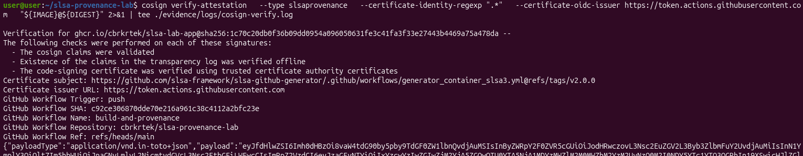

Cosign can read the same builder cert info out of the transparency log — it just
doesn't force you to check it against anything. `slsa-verifier` makes you declare
`--source-uri`/`--source-branch` up front and fails if reality doesn't match.

## Attack 1: image pushed outside the pipeline

Simulating stolen registry credentials — push a build directly, skip CI entirely:

```bash
docker build -t ghcr.io/cbrkrtek/slsa-lab-app:manual-push ./app
docker push ghcr.io/cbrkrtek/slsa-lab-app:manual-push
```

```bash
DIGEST_MANUAL=$(crane digest ghcr.io/cbrkrtek/slsa-lab-app:manual-push)

slsa-verifier verify-image "ghcr.io/cbrkrtek/slsa-lab-app@${DIGEST_MANUAL}" \
  --source-uri github.com/cbrkrtek/slsa-provenance-lab \
  --source-branch main
```

```
FAILED: SLSA verification failed: no matching attestations:
```

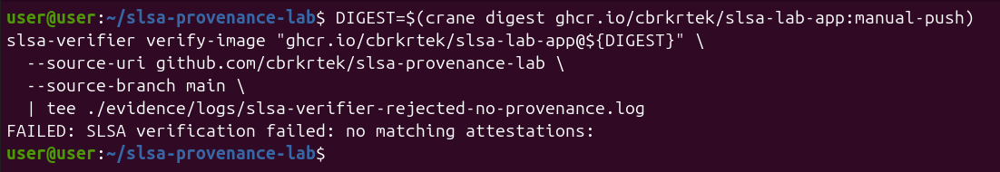

No provenance ever got attached to that digest, so there's nothing to check
against. This is what a real "image pushed outside CI" incident looks like from
the verifier's side.

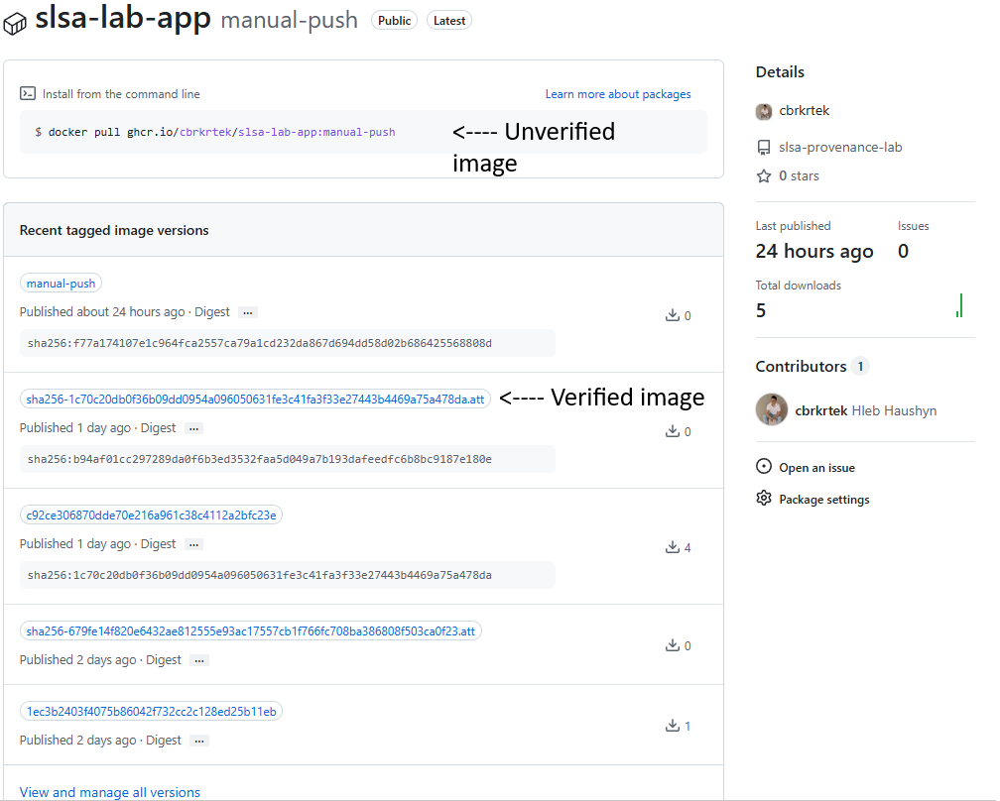

## Attack 2: forge the provenance JSON

Pulled the real provenance:

```bash
cosign download attestation "${IMAGE}@${DIGEST}" \
  | jq -r '.payload' | base64 -d | jq '.' > evidence/json/real-provenance.json
```

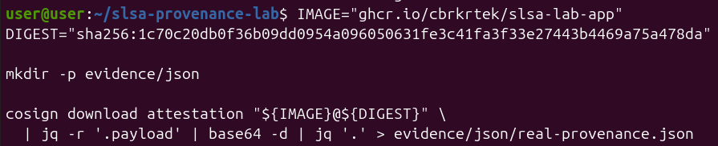

```bash
jq '{
  subject: .subject,
  builder: .predicate.builder.id,
  buildType: .predicate.buildType,
  source: .predicate.invocation.configSource
}' evidence/json/real-provenance.json
```

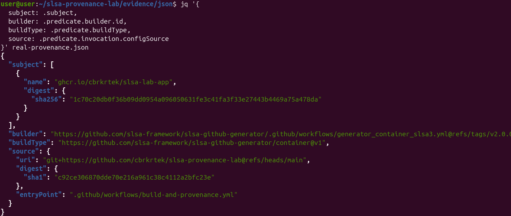

Edited `source.uri` and `source.digest.sha1` to point at a fake attacker repo,
kept everything else identical:

```bash
diff evidence/json/real-provenance.json evidence/json/forged-provenance.json
```

```diff
<         "uri": "git+https://github.com/cbrkrtek/slsa-provenance-lab@refs/heads/main",
---
>         "uri": "git+https://github.com/attacker/evil-repo",
<           "sha1": "c92ce306870dde70e216a961c38c4112a2bfc23e"
---
>           "sha1": "deadbeefdeadbeefdeadbeefdeadbeefdeadbeef"
```

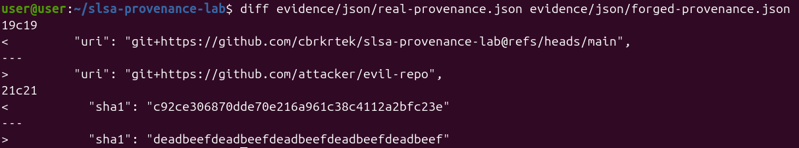

Expected outcome: feed this to `slsa-verifier` via `--provenance-path`, get
rejected because the DSSE signature no longer matches the payload.

```bash
slsa-verifier verify-image "${IMAGE}@${DIGEST}" \
  --source-uri github.com/cbrkrtek/slsa-provenance-lab \
  --provenance-path evidence/json/forged-provenance.json
```

```
PASSED: Verified SLSA provenance
```

Not what I expected. Before writing this up as a bypass, I ran a control test —
swapped the forged file for `/dev/null`:

```bash
slsa-verifier verify-image "${IMAGE}@${DIGEST}" \
  --source-uri github.com/cbrkrtek/slsa-provenance-lab \
  --provenance-path /dev/null
```

```
PASSED: Verified SLSA provenance
```

Same result.

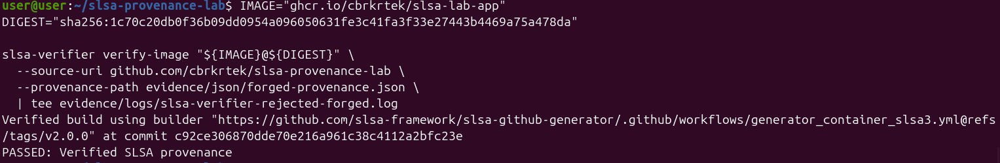
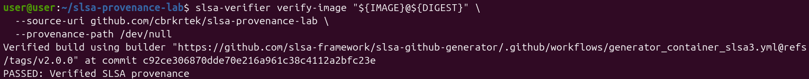

**What's actually going on:** `--provenance-path` doesn't override anything for
`verify-image`. The command always fetches and checks whatever's cryptographically
attached to that digest in the registry — the local file argument gets ignored
entirely. I went in expecting a signature mismatch to catch the forgery. What
actually happens is one layer earlier: there's no code path for a local file to
substitute for the registry-attested provenance when verifying a container image
at all. If you want to actually test the signature check, you'd have to attach a
different, real, signed attestation to that digest in the registry — a
meaningfully different (and harder) experiment than editing a JSON file on disk.

Rekor entry for the legit build, found by digest:

```bash
rekor-cli search --sha 1c70c20db0f36b09dd0954a096050631fe3c41fa3f33e27443b4469a75a478da
```

```
Found matching entries (listed by UUID):
108e9186e8c5677ad7a17a74a009d6b79592942feae0e683c4f685928957b137f31ba1a0b949b22d
```

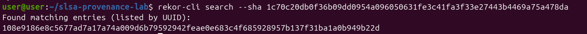

## Signing vs provenance

| | Cosign | SLSA provenance |
|---|---|---|
| Proves | Not altered since signing | Built from this commit, by this exact CI |
| Checks source/commit | Not by default | Yes, explicitly |
| Checks builder identity | Readable from the cert, not enforced | Enforced via `--source-uri`/`--source-branch` |
| If the build job itself is compromised | No protection | Provenance generation runs in an isolated job, outside the build job's reach |
| Can a local file override verification | n/a | No, confirmed above — always checks the registry |


## Reproducing

```bash
git clone https://github.com/cbrkrtek/slsa-provenance-lab
cd slsa-provenance-lab/verification
./verify-legit.sh <git-sha-tag>
```
